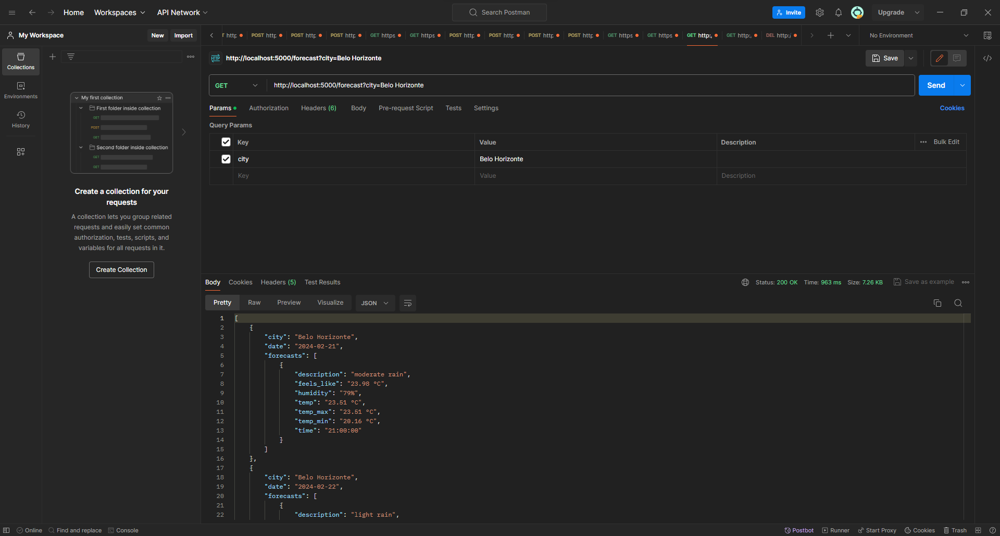
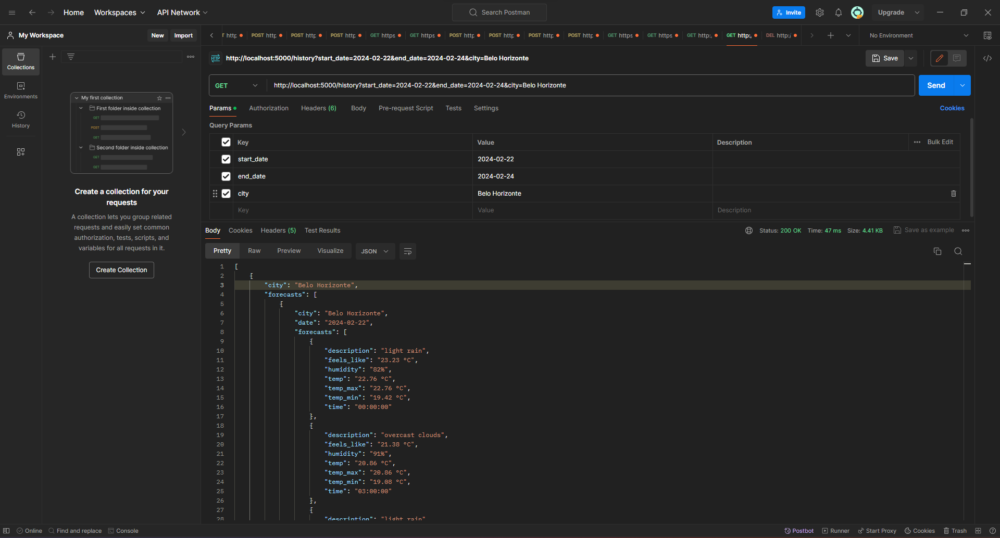
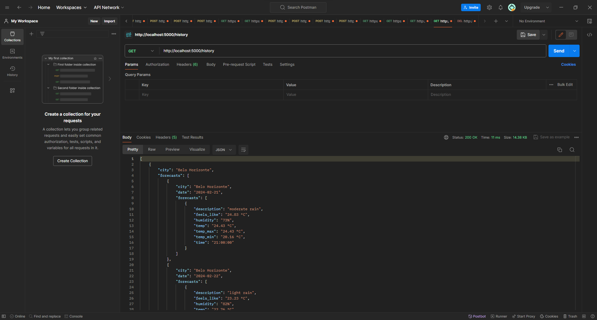
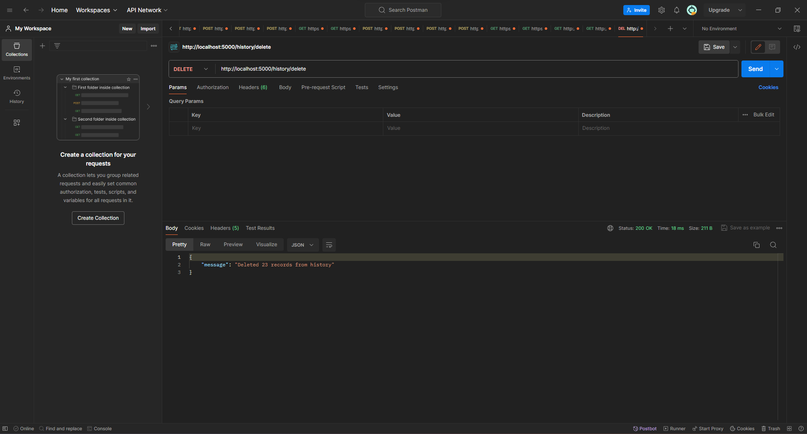

# WeatherDock

A WeatherDock é uma API que fornece previsões meteorológicas para diferentes cidades. Com a WeatherDock, os usuários podem obter dados meteorológicos atuais e previsões futuras para suas cidades desejadas.

## Pré-requisitos 

Docker e o Docker Compose devem estar instalados na máquina

- [Instalação do Docker](https://docs.docker.com/get-docker/)
- [Instalação do Docker Compose](https://docs.docker.com/compose/install/)

## Iniciando a aplicação

1. Clone o repositório para sua máquina local.

2. Navegue até a pasta raiz do projeto.

3. Execute o seguinte comando no terminal para construir e iniciar os contêineres Docker:

    ```
    docker-compose up --build
    ```

4. Após a construção do projeto, a API estará acessível na seguinte URL:

    ```
    http://localhost:5000
    ```

5. Para finalizar a aplicação, você pode utilizar o seguinte comando:

    ```
    docker-compose down
    ```

## Rotas da API

A API WeatherDock oferece as seguintes rotas para acesso aos dados meteorológicos:

### 1. Buscar previsão dos próximos 5 dias:

- **Endpoint:** `/weather`
- **Método:** `GET`
- **Parâmetros:**
  - `city` (str): Nome da cidade (padrão: Belo Horizonte)
  - `units` (str): Unidades de medida para temperatura (padrão: métrico)
- **Exemplo de uso:**
GET /weather?city=Belo Horzionte&units=metric
- **Exemplo de resposta:**
  ```json
  {
      "city_name": "Belo Horizonte",
      "forecasts": [
          {
              "date": "2024-02-21",
              "forecasts": [
                  {
                      "time": "21:00:00",
                      "temp": "24.43°C",
                      "temp_min": "20.16°C",
                      "temp_max": "24.43°C",
                      "humidity": "73%",
                      "feels_like": "24.83°C",
                      "description": "moderate rain"
                  }
              ]
          },
          ...
      ]
  }
  ```

### 2. Recuperar solicitações passadas:

- **Endpoint:** `/history`
- **Método:** `GET`
- **Parâmetros:**
- `start_date` (str): Data de início (YYYY-MM-DD)
- `end_date` (str): Data final (YYYY-MM-DD)
- `city` (str): Nome da cidade (opcional)
- **Exemplo de uso:**
GET /history?start_date=2024-02-21&end_date=2024-02-25&city=Belo Horizonte
- **Exemplo de resposta:**
  ```json
  [
      {
          "city": "Belo Horizonte",
          "forecasts": [
              {
                  "date": "2024-02-21",
                  "forecasts": [
                      {
                          "time": "21:00:00",
                          "temp": "24.43°C",
                          "temp_min": "20.16°C",
                          "temp_max": "24.43°C",
                          "humidity": "73%",
                          "feels_like": "24.83°C",
                          "description": "moderate rain"
                      }
                  ]
              },
              ...
          ]
      },
      ...
  ]
  ```
### 3. Excluir histórico de solicitações:

- **Endpoint:** `/history/delete`
- **Método:** `DELETE`
- **Parâmetros:** Nenhum
- **Exemplo de uso:**
DELETE /history/delete
- **Exemplo de resposta:**
  ```json
  {
      "message": "Deleted 23 records from history"
  }
  ```

## Exemplos de Requisições

### 1. Obter previsão do tempo para uma cidade:



### 2. Listar histórico de solicitações:





### 3. Excluir histórico de solicitações:

